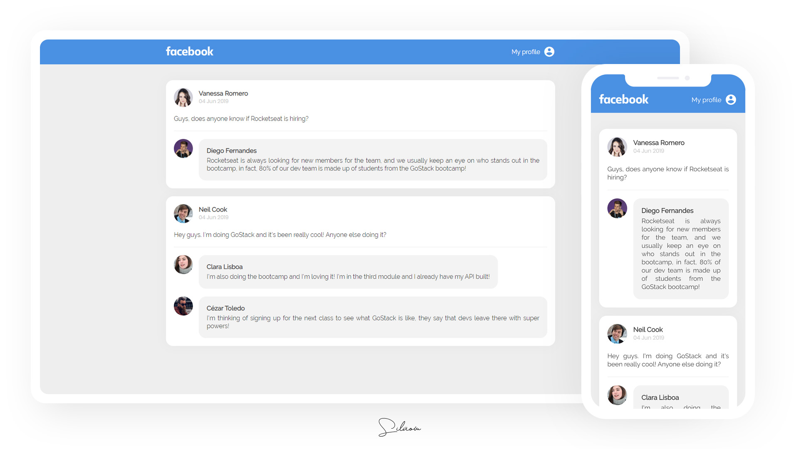

# GoStack Challenge 4

:newspaper: Challenge proposed during [@Rocketseat](https://github.com/rocketseat)'s GoStack bootcamp that consists of developing an interface (with static data) similar to Facebook using React.js with styled components.

Technologies and tools used on this project:

- HTML
- CSS
- JavaScript
- React.js
- Styled Components

